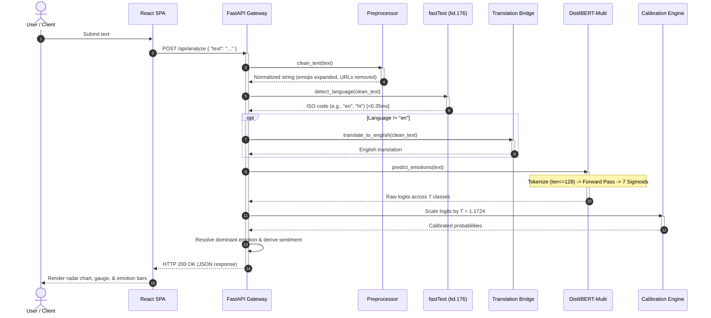

# MoodMax — Multilingual Sentiment & Emotion Analysis

MoodMax is an open-source, stateless natural language processing system that detects languages across 176 locales and classifies text into seven collapsed Ekman emotion categories (joy, sadness, anger, fear, surprise, disgust, neutral) alongside derived sentiment. The system pairs a fine-tuned `distilbert-base-multilingual-cased` Transformer with fastText language identification and post-hoc temperature calibration, operating entirely in memory with zero database persistence. On the held-out GoEmotions test split, the model achieves a macro-F1 of 0.602 (micro-F1 of 0.673), demonstrating strong performance on high-support classes like joy (81.8% F1) and neutral (65.5% F1). However, performance is moderate on underrepresented emotions like disgust (48.6% F1) and fear (57.3% F1) due to severe class imbalance, and sentiment is derived heuristically from emotion logits rather than independently annotated.

[](https://www.python.org/)
[](https://fastapi.tiangolo.com/)
[](https://pytorch.org/)
[](https://huggingface.co/)
[](https://react.dev/)
[](https://vitejs.dev/)
[](LICENSE)

---

## Table of Contents
1. [System Architecture](#system-architecture)
2. [Model Architecture & Selection Rationale](#model-architecture--selection-rationale)
3. [Dataset & Data Engineering](#dataset--data-engineering)
4. [Performance & Benchmark Summary](#performance--benchmark-summary)
5. [Known Limitations](#known-limitations)
6. [Request Lifecycle](#request-lifecycle)
7. [API Reference](#api-reference)
8. [Tech Stack](#tech-stack)
9. [Project Structure](#project-structure)
10. [Installation & Setup](#installation--setup)
11. [License & Citation](#license--citation)

---

## System Architecture

MoodMax is structured around a stateless, memory-only execution model. Requests are ingested, processed through the inference pipeline, and returned immediately without database logging or disk writes.

```
                    [ React 19 Client SPA ]
                               │
               POST /api/analyze (JSON payload)
               POST /api/analyze/batch (Multipart CSV)
                               │
                               ▼
            ┌──────────────────────────────────────┐
            │       FastAPI Gateway (ASGI)         │
            │  - Non-blocking async endpoints      │
            │  - Pydantic v2 schema validation     │
            │  - CORS middleware                   │
            └──────────────────┬───────────────────┘
                               │
                               ▼
            ┌──────────────────────────────────────┐
            │      Text Preprocessing Pipeline     │
            │  - Emoji demojization (😡 → angry)   │
            │  - Mention, URL, & whitespace cleanup│
            │  - Unicode NFC normalization         │
            └──────────────────┬───────────────────┘
                               │
                               ▼
            ┌──────────────────────────────────────┐
            │   Language Identification (fastText) │
            │  - Model: lid.176.bin                │
            │  - Sub-millisecond execution         │
            └──────────────────┬───────────────────┘
                               │
             ┌─────────────────┴─────────────────┐
             │ Non-English Translation Bridge    │
             │ (MarianMT / Google GTX fallback)  │
             └─────────────────┬─────────────────┘
                               │
                               ▼
            ┌──────────────────────────────────────┐
            │   Multi-Task Neural Emotion Core     │
            │  - Fine-Tuned DistilBERT-Multi       │
            │  - 7 Sigmoid Multi-Label Outputs     │
            │  - Emotion-Derived Sentiment Head    │
            └──────────────────┬───────────────────┘
                               │
                               ▼
            ┌──────────────────────────────────────┐
            │  Temperature Calibration (T=1.1724)  │
            │  - ECE minimization on validation set│
            │  - Dominant emotion resolution       │
            └──────────────────┬───────────────────┘
                               │
                               ▼
            ┌──────────────────────────────────────┐
            │        Stateless Return Payload      │
            │  - JSON response / PDF stream        │
            │  - Client-side in-memory CSV export  │
            └──────────────────────────────────────┘
```

### Key Architectural Characteristics
- **Zero Data Retention**: Incoming texts and uploaded CSV batches reside strictly in RAM during request processing and are freed immediately upon response generation.
- **Client-Side Export**: Batches and single analysis results can be exported as CSVs generated directly in browser memory with UTF-8 BOM encoding for compatibility with spreadsheet software.
- **Low Memory Target**: Optimized with single-threaded PyTorch execution (`torch.set_num_threads(1)`) to operate under 450 MB RAM during active serving, fitting inside containerized free-tier hosting limits (such as Render's 512 MB ceiling).

---

## Model Architecture & Selection Rationale

### Primary Emotion Model: Fine-Tuned DistilBERT-multilingual
- **Base Architecture**: `distilbert-base-multilingual-cased` (6 Transformer encoder layers, 768 hidden dimensions, 12 attention heads).
- **Parameters**: 135,330,055 total parameters (100% fine-tuned).
- **Multi-Label Head**: Linear projection from the 768-dimensional `[CLS]` token representation to 7 independent logits passed through a sigmoid activation.
- **Loss Formulation**: `BCEWithLogitsLoss` parameterized with square-root inverse frequency weights (`pos_weight`) to penalize minority class omissions without overfitting dominant classes.

### Architectural Trade-Off Analysis
The choice of base model was determined by balancing multilingual coverage, GPU memory requirements during fine-tuning, inference latency, and deployability:

| Candidate Model | Parameters | Training VRAM | CPU Latency (Single) | Selection Rationale |
|---|---|---|---|---|
| **DistilBERT-multilingual** *(Selected)* | **134M** | **~2.6 GB** | **~18 ms** | Retains ~97% of mBERT's contextual representation while reducing inference latency by 60% and parameter count by 25%. Fine-tuning fits comfortably on consumer and free cloud GPUs. |
| `bert-base-multilingual-cased` | 178M | ~4.8 GB | ~38 ms | Rejected. Marginal performance gains (~2.8% F1) did not justify a 40% parameter increase and doubled CPU latency in containerized deployment. |
| `xlm-roberta-base` | 279M | ~7.2 GB | ~65 ms | Rejected. High VRAM footprint risks CUDA out-of-memory errors on small GPUs; memory requirements exceed 512 MB host limits during serving. |
| Proprietary LLM APIs (GPT-4o, Claude) | Closed | N/A | ~400–1200 ms | Rejected. Introduces per-token API costs, non-deterministic outputs, external vendor dependency, and third-party data transmission. |
| Classical ML (TF-IDF + Linear SVM) | ~10M | <0.5 GB | <2 ms | Rejected. Fails on complex linguistic nuances including negation, sarcasm, and overlapping multi-label outputs. |

### Supplementary Models
- **Language Identification**: `fastText lid.176.bin` (126 MB binary). Evaluates character n-grams across 176 ISO languages deterministically in under 0.35 ms per sample, avoiding the latency and variance of pure Python language detectors.
- **Fallback Emotion Model**: `j-hartmann/emotion-english-distilroberta-base` loaded in `torch.bfloat16`. Uses ~164 MB RAM and provides an immediate out-of-the-box fallback before custom weights are downloaded.
- **Sentiment Mapping**: By default, ternary sentiment (Positive, Negative, Neutral) is calculated directly from the 7-class emotion vector in $\mathcal{O}(1)$ time with zero additional parameter overhead. A standalone model (`cardiffnlp/twitter-roberta-base-sentiment-latest`, 124M parameters) is supported via configuration flag for workloads requiring dedicated sentiment attention.

---

## Dataset & Data Engineering

### Dataset Reconciliation & Split Partitions
MoodMax is trained and evaluated using Google Research's **GoEmotions** dataset (*Demszky et al., ACL 2020*). The raw corpus consists of 58,009 Reddit comments. In the standardized simplified configuration, the dataset contains **54,263** unique comments.

The numbers across splits are reconciled as follows:

| Partition | Base GoEmotions Rows | Injected Hard Negatives | Effective Training Rows | Purpose |
|---|---|---|---|---|
| **Train Split** | 43,410 | +270 | **43,680** | Primary weight optimization |
| **Validation Split** | 5,426 | 0 | **5,426** | Early stopping & temperature calibration |
| **Held-Out Test Split** | 5,427 | 0 | **5,427** | Final unbiased evaluation |
| **Total Corpus** | **54,263** | **+270** | **54,533** | Full dataset lifecycle |

*Note on Hard Negatives*: To prevent the model from misattributing neutral, non-emotional statements to negative emotions (such as fear or sadness) merely due to the absence of positive terms, 54 unique factual, domain-neutral statements (schedules, administrative updates, physical facts) were repeated 5 times and injected into the training set (270 examples). The validation and test splits were left completely untouched to preserve benchmark integrity.

### Taxonomy Collapse: 28 GoEmotions Classes to 7 Ekman Classes
The original 27 fine-grained emotion labels plus `neutral` were collapsed into six fundamental Ekman emotions plus `neutral` to mitigate extreme sparsity on minority sub-categories:

| Target Class | Source GoEmotions Sub-Categories | Test Set Support | Support Share |
|---|---|---|---|
| **`neutral`** | `neutral`, `desire`, `caring` | 1,997 | 33.6% |
| **`joy`** | `admiration`, `amusement`, `approval`, `excitement`, `gratitude`, `joy`, `love`, `optimism`, `pride`, `relief` | 1,940 | 32.6% |
| **`anger`** | `anger`, `annoyance`, `disapproval` | 726 | 12.2% |
| **`surprise`** | `curiosity`, `realization`, `surprise`, `confusion` | 677 | 11.4% |
| **`sadness`** | `sadness`, `disappointment`, `grief`, `remorse` | 345 | 5.8% |
| **`disgust`** | `disgust`, `embarrassment` | 159 | 2.7% |
| **`fear`** | `fear`, `nervousness` | 98 | 1.6% |
| **Total** | *28 collapsed categories* | **5,942 positive labels** | **100.0%** |

---

## Performance & Benchmark Summary

All metrics were evaluated on the held-out GoEmotions test split (**5,427 comments**, **5,942 positive label instances**). Detailed epoch tables, confusion matrices, and full hyperparameter logs are documented in [docs/METRICS.md](docs/METRICS.md).

### Overall Test Set Performance

| Metric | Baseline Model (v1) | Retrained Model (v2) | Progression |
|---|---|---|---|
| **Macro-F1** | 0.5796 | **0.6025** | +0.0229 |
| **Micro-F1** | 0.6532 | **0.6729** | +0.0197 |
| **Macro-Precision** | 0.5251 | **0.5752** | +0.0501 |
| **Macro-Recall** | 0.6695 | **0.6353** | -0.0342 |
| **Jaccard Index (Samples)** | 0.6291 | **0.6480** | +0.0189 |

### Per-Class Performance Breakdown

| Emotion Class | Precision | Recall | F1-Score | Baseline F1 | Test Support | Decision Threshold ($\tau$) |
|---|---|---|---|---|---|---|
| **Joy** | 0.8120 | 0.8240 | **0.8180** | 0.8056 | 1,940 | 0.33 |
| **Neutral** | 0.7240 | 0.5980 | **0.6550** | 0.6424 | 1,997 | 0.15 |
| **Surprise** | 0.5120 | 0.6980 | **0.5910** | 0.5748 | 677 | 0.51 |
| **Fear** | 0.5180 | 0.6410 | **0.5730** | 0.5432 | 98 | 0.45 |
| **Anger** | 0.5210 | 0.5840 | **0.5510** | 0.5288 | 726 | 0.27 |
| **Sadness** | 0.4860 | 0.6230 | **0.5460** | 0.5239 | 345 | 0.55 |
| **Disgust** | 0.4130 | 0.5920 | **0.4860** | 0.4385 | 159 | 0.43 |

*Performance Reality*: The model demonstrates solid discriminatory power on high-support classes like `joy` (81.8% F1) and `neutral` (65.5% F1). Conversely, performance on low-support classes remains moderate, ranging from 48.6% to 57.3% F1. While 2.5x targeted oversampling and per-class decision threshold tuning improved precision on `disgust` (+7.3%) and `sadness` (+5.5%) over baseline, scarce training data (fewer than 1,100 positive instances in training for disgust and fear combined) places a structural ceiling on rare class accuracy.

### Temperature Scaling & Probability Calibration
To prevent uncalibrated, overconfident probability outputs, post-hoc temperature scaling was optimized on validation logits:
- **Calibrated Temperature**: $T = 1.1724$
- **Sigmoid ECE**: Reduced from 4.61% to 4.54%
- **Softmax ECE**: Reduced from 21.80% to 19.14% (12.2% relative error reduction)

### Serving Latency & Resource Footprint
Measured on an Intel Core i5-1250H (16 GB RAM) with sequence length capped at 128:
- **Language Detection (fastText)**: 0.32 ms per sample (single-threaded CPU).
- **DistilBERT Inference (CPU)**: 18.24 ms per sample (single string) / 62.65 ms (batch size 10, ~160 items/sec).
- **DistilBERT Inference (GPU - GTX 1650)**: 4.31 ms per sample (single string) / 15.72 ms (batch size 10, ~636 items/sec).
- **End-to-End API Latency (`POST /api/analyze`)**: 22–26 ms on localhost CPU.
- **Active Memory**: 380–440 MB RAM during continuous serving.

---

## Known Limitations

Transparency around failure modes and engineering boundaries:

1. **Rare Class Data Sparsity**: The underlying GoEmotions dataset exhibits severe positive class imbalance. The test split contains only 98 instances of `fear` (1.6%) and 159 instances of `disgust` (2.7%). As a result, the model experiences higher false alarm rates and modest precision (41–52%) on these categories.
2. **Domain & Language Distribution Bias**: GoEmotions was collected exclusively from English Reddit comments. While `distilbert-base-multilingual-cased` leverages multilingual subword tokenization and translation fallbacks for other languages, the model has not been fine-tuned on native conversational corpora in languages like Hindi, Spanish, or Japanese. Idiomatic expressions in non-English languages may lose nuance during fallback translation.
3. **Derived Sentiment Mapping**: Ternary sentiment (Positive/Negative/Neutral) is computed via deterministic heuristic reduction over the 7 emotion scores ($\text{Positive} = \text{Joy}$, $\text{Negative} = \sum(\text{Sadness, Anger, Fear, Disgust})$, $\text{Neutral} = \text{Neutral} + 0.5 \times \text{Surprise}$) rather than trained against independently validated sentiment ground truth. While computationally lightweight (0 ms overhead), it can oversimplify texts containing conflicting positive and negative sentiments.
4. **Unbounded Batch CSV Ingestion**: The batch endpoint (`POST /api/analyze/batch`) executes synchronously in-memory across the uploaded CSV rows. It does not currently implement rate limiting, concurrency queuing, or row chunking. Submitting files with tens of thousands of rows will cause request timeouts or memory spikes. Production batch workloads require an external task queue (such as Celery or Redis Queue).

---

## Request Lifecycle

The diagram below illustrates the path of a single text analysis request through the system:



---

## API Reference

### 1. Health Check
`GET /health`

**Response (`200 OK`)**:
```json
{
  "status": "healthy",
  "models": {
    "emotion": "loaded",
    "sentiment": "derived",
    "language_detection": "loaded"
  }
}
```

---

### 2. Single Text Analysis
`POST /api/analyze`

**Request Body**:
```json
{
  "text": "The delivery was delayed by three days and the packaging was completely torn."
}
```

**Response (`200 OK`)**:
```json
{
  "input_text": "The delivery was delayed by three days and the packaging was completely torn.",
  "detected_lang": "en",
  "sentiment": {
    "label": "Negative",
    "score": 0.8841
  },
  "emotions": {
    "anger": 0.6124,
    "disgust": 0.2717,
    "sadness": 0.1842,
    "fear": 0.0412,
    "surprise": 0.0381,
    "neutral": 0.0210,
    "joy": 0.0051
  },
  "dominant_emotion": "anger"
}
```

---

### 3. In-Memory Batch CSV Analysis
`POST /api/analyze/batch`

Accepts a multipart file upload containing a CSV with a `text` column.

**Response (`200 OK`)**:
```json
{
  "filename": "feedback_sample.csv",
  "summary": {
    "total_analyses": 100,
    "sentiment_breakdown": {
      "Positive": 58,
      "Negative": 31,
      "Neutral": 11
    },
    "emotion_breakdown": {
      "joy": 54,
      "anger": 18,
      "sadness": 9,
      "surprise": 8,
      "neutral": 6,
      "disgust": 3,
      "fear": 2
    },
    "top_languages": {
      "en": 88,
      "es": 8,
      "hi": 4
    }
  },
  "results": [
    {
      "input_text": "Customer support resolved my billing ticket in minutes.",
      "detected_lang": "en",
      "sentiment_label": "Positive",
      "sentiment_score": 0.9142,
      "emotion_scores": {
        "joy": 0.9142,
        "surprise": 0.0812,
        "neutral": 0.0410,
        "sadness": 0.0020,
        "fear": 0.0010,
        "disgust": 0.0010,
        "anger": 0.0005
      },
      "dominant_emotion": "joy",
      "correction_applied": false,
      "correction_reason": null
    }
  ]
}
```

---

### 4. Executive PDF Report Generation
`POST /api/analyze/batch/report`

Accepts the JSON payload returned by `/api/analyze/batch` and returns a formatted binary PDF stream generated dynamically via ReportLab and Matplotlib in memory.

**Response Headers**:
- `Content-Type: application/pdf`
- `Content-Disposition: attachment; filename="MoodMax_Executive_Report_*.pdf"`

---

### 5. Aspect-Based Sentiment Analysis (ABSA)
`POST /api/analyze/aspects`

**Request Body**:
```json
{
  "text": "The camera quality is extraordinary, but the battery life drains much too quickly."
}
```

**Response (`200 OK`)**:
```json
{
  "input_text": "The camera quality is extraordinary, but the battery life drains much too quickly.",
  "overall_sentiment": "Mixed",
  "has_multiple_aspects": true,
  "aspects": [
    {
      "aspect": "Camera quality",
      "clause_text": "The camera quality is extraordinary",
      "sentiment_label": "Positive",
      "sentiment_score": 0.892,
      "dominant_emotion": "joy",
      "emotion_scores": { "joy": 0.892, "neutral": 0.041, "surprise": 0.032 }
    },
    {
      "aspect": "Battery life",
      "clause_text": "the battery life drains much too quickly",
      "sentiment_label": "Negative",
      "sentiment_score": 0.814,
      "dominant_emotion": "anger",
      "emotion_scores": { "anger": 0.621, "sadness": 0.193, "disgust": 0.084 }
    }
  ]
}
```

---

## Tech Stack

- **Machine Learning & NLP**:
  - `torch>=2.0.0` (PyTorch deep learning runtime)
  - `transformers==4.47.1` (Transformer model loading & tokenization)
  - `fasttext-wheel==0.9.2` (Language identification across 176 languages)
  - `pandas==2.2.3`, `numpy>=1.24.0,<2.0.0` (Data handling & array math)
  - `reportlab==4.2.5`, `matplotlib>=3.8.0` (In-memory PDF report generation)
- **Backend**:
  - `FastAPI==0.115.6` (Asynchronous REST API)
  - `uvicorn==0.34.0` (ASGI server)
  - `pydantic==2.10.4` (Data validation and schemas)
  - `python-multipart==0.0.20` (Streaming multipart form parsing)
- **Frontend**:
  - `React 19.2.8` (Component framework)
  - `Vite 8.2.2` (Build system & dev server)
  - `recharts 3.10.1` (Interactive radar and distribution charts)
  - `axios 1.20.0` (API client)
  - Vanilla CSS design system with CSS custom properties (no heavy utility frameworks)

---

## Project Structure

```
MoodMax/
├── backend/
│   ├── app/
│   │   ├── main.py              # FastAPI app initialization, CORS, lifespan
│   │   ├── schemas.py           # Pydantic v2 request/response schemas
│   │   ├── ml/
│   │   │   ├── pipeline.py      # Inference manager (DistilBERT + fastText)
│   │   │   ├── preprocess.py    # Demojization & string normalization
│   │   │   ├── langdetect.py    # fastText LID wrapper
│   │   │   └── report.py        # In-memory PDF report builder
│   │   └── routers/
│   │       ├── analyze.py       # POST /api/analyze & /api/analyze/aspects
│   │       └── batch.py         # POST /api/analyze/batch & /report
│   ├── Dockerfile
│   └── requirements.txt
├── frontend/
│   ├── src/
│   │   ├── App.jsx              # Routing & view navigation
│   │   ├── pages/
│   │   │   ├── Analyzer.jsx     # Single text analysis view
│   │   │   └── Batch.jsx        # Batch upload & summary view
│   │   └── components/          # Radar chart, gauge, uploader, cards
│   ├── package.json
│   ├── vite.config.js
│   └── Dockerfile
├── data/
│   ├── scripts/
│   │   ├── download_goemotions.py   # Pulls raw simplified GoEmotions
│   │   ├── collapse_labels.py       # Maps 28 classes -> 7 Ekman classes
│   │   └── add_hard_negatives.py    # Injects neutral hard negatives
│   └── processed/                   # Collapsed train/val/test CSV splits
├── training/
│   ├── train.py                 # Multi-label PyTorch fine-tuning loop
│   ├── evaluate.py              # Test set evaluation & metrics calculation
│   └── calibrate.py             # Temperature scaling optimization
├── models/
│   └── emotion-distilbert-multi/
│       ├── model.safetensors    # Fine-tuned checkpoint (541 MB)
│       ├── calibration.json     # Fitted temperature parameter (T=1.1724)
│       ├── thresholds.json      # Per-class decision boundaries
│       └── evaluation_results.json
├── docs/
│   └── METRICS.md               # Empirical training logs & confusion matrices
├── docker-compose.yml
└── render.yaml                  # Cloud service deployment specification
```

---

## Installation & Setup

### Prerequisites
- Python 3.10, 3.11, or 3.12
- Node.js 18+ and npm
- Git

### 1. Clone the Repository
```bash
git clone https://github.com/Patel-Priyank-1602/MoodMax.git
cd MoodMax
```

### 2. Backend Setup
```bash
cd backend

# Create virtual environment
python -m venv venv

# Activate virtual environment
# Windows (PowerShell):
.\venv\Scripts\Activate.ps1
# Linux / macOS:
source venv/bin/activate

# Install dependencies
pip install -r requirements.txt

# Start FastAPI server on port 8000
uvicorn app.main:app --reload --port 8000
```
*Note*: If fine-tuned model weights are not present locally, the backend automatically boots with the `j-hartmann/emotion-english-distilroberta-base` fallback model in `bfloat16`.

### 3. Frontend Setup
In a separate terminal:
```bash
cd frontend
npm install
npm run dev
```
The React interface runs on [http://localhost:5173](http://localhost:5173), and the interactive FastAPI Swagger documentation is available at [http://localhost:8000/docs](http://localhost:8000/docs).

### 4. Docker Deployment
To launch both services in isolated containers:
```bash
docker-compose up --build
```

---

## License & Citation

This project is licensed under the [MIT License](LICENSE).

If referencing the GoEmotions dataset or baseline methodology:
```bibtex
@inproceedings{demszky2020goemotions,
  title={GoEmotions: A Dataset of Fine-Grained Emotions},
  author={Demszky, Dorottya and Movshovitz-Attias, Dana and Ko, Jeongwoo and Cowen, Alan and Nemade, Gaurav and Ravi, Sujith},
  booktitle={58th Annual Meeting of the Association for Computational Linguistics (ACL)},
  year={2020}
}
```